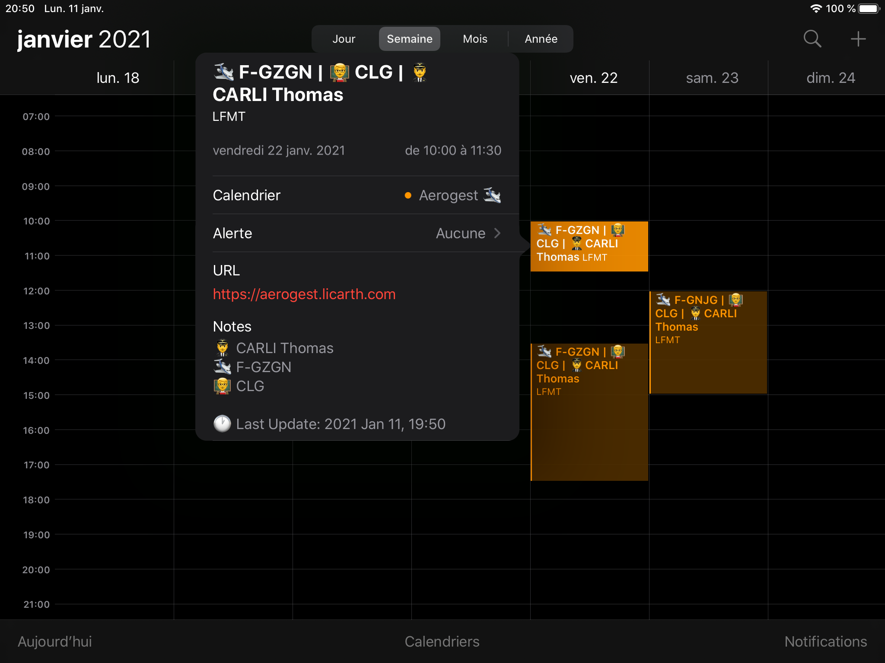
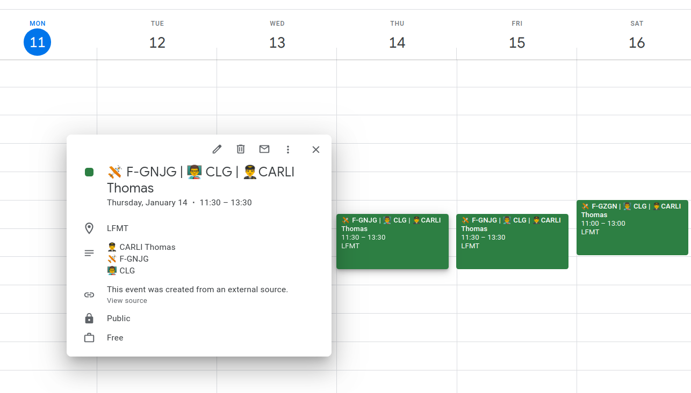

# `aero-ics-calendar-sync`

🇬🇧 [English readme here](README_EN.md).
## Utiliser le calendrier
### Dans iOS (iPad, iPhone)

<p float="left">
  
  
</p>

1. Accédez à Réglages  > Calendrier > Comptes > Ajouter un compte > Autre.
2. Touchez « Ajouter un cal. avec abonnement ».
3. Saisissez l’URL suivante en prenant soin de remplacer <AEROGEST_EMAIL> et <AEROGEST_PASSWORD>
```
https://aero-ics-calendar-sync.licarth.com/flight-calendar?email=<AEROGEST_EMAIL>&password=<AEROGEST_PASSWORD>
```

> 💡 Les serveurs de cette application ne stockent pas votre mot de passe aerogest. Ils l'utilisent pour se connecter à `aerogest-online.fr` afin de récupérer vos prochaines réservations de vol. Les serveurs stockent seulement des données temporaires d'authentification (cookies) comme votre navigateur le fait, pour éviter d'avoir à se reconnecter en votre nom à chaque fois qu'ils rafraîchissent le calendrier.

### Dans Google Calendar



#### Directement dans Google calendar 👎
> ⚠️ Not Recommended ⚠️ This will only refresh your calendar every 24h approximately

Vous pouvez importer le calendrier à partir de https://calendar.google.com/

1. Dans le menu de gauche, cliquez sur le symbole ➕ à côté de "Autres Calendriers"
2. Sélectionnez "Depuis l'URL"
3. Saisissez l’URL suivante en prenant soin de remplacer <AEROGEST_EMAIL> et <AEROGEST_PASSWORD>
```
https://aero-ics-calendar-sync.licarth.com/flight-calendar?email=<AEROGEST_EMAIL>&password=<AEROGEST_PASSWORD>
```
4. Cliquez sur "Ajouter le calendrier". Vous devriez voir vos prochains vols apparaître dans votre calendrier.

#### Avec GAS-ICS-Sync 👍

Utilisez l'excellent [GAS-ICS-Sync](https://github.com/derekantrican/GAS-ICS-Sync) de `derekantrican`.

C'est un script Google Apps Script qui permet
- choisir l'intervalle avec lequel vous voulez rafraîchir votre calendrier (toutes les 5 minutes là où Google Calendar ne peut que toutes les 24 heures)
- avoir des notifications lorsqu'un de vos vols a changé.

1. Suivez les instructions [données ici (En Anglais 🇬🇧)](https://github.com/derekantrican/GAS-ICS-Sync/wiki/Setting-up-the-script-manually) pour installer le script.
2. Dans `Code.gs`, configurez le script avec les paramètres suivants: (remplacez `<AEROGEST_EMAIL>` & `<AEROGEST_PASSWORD>`.)
 ```javascript
var sourceCalendars = [                // The ics/ical urls that you want to get events from along with their target calendars (list a new row for each mapping of ICS url to Google Calendar)
  // For instance: ["https://www.calendarlabs.com/ical-calendar/ics/76/US_Holidays.ics", "US Holidays"]
  ["https://aero-ics-calendar-sync.licarth.com/flight-calendar?email=<AEROGEST_EMAIL>&password=<AEROGEST_PASSWORD>&lastUpdateInEventDescription=0", "Aerogest Flights 🛩"],
];

var howFrequent = 5;                  // What interval (minutes) to run this script on to check for new events
var onlyFutureEvents = false;          // If you turn this to "true", past events will not be synced (this will also removed past events from the target calendar if removeEventsFromCalendar is true)
var addEventsToCalendar = true;        // If you turn this to "false", you can check the log (View > Logs) to make sure your events are being read correctly before turning this on
var modifyExistingEvents = true;       // If you turn this to "false", any event in the feed that was modified after being added to the calendar will not update
var removeEventsFromCalendar = true;   // If you turn this to "true", any event created by the script that is not found in the feed will be removed.
var addAlerts = true;                  // Whether to add the ics/ical alerts as notifications on the Google Calendar events, this will override the standard reminders specified by the target calendar.
var addOrganizerToTitle = false;       // Whether to prefix the event name with the event organiser for further clarity
var descriptionAsTitles = false;       // Whether to use the ics/ical descriptions as titles (true) or to use the normal titles as titles (false)
var addCalToTitle = false;             // Whether to add the source calendar to title
var addAttendees = false;              // Whether to add the attendee list. If true, duplicate events will be automatically added to the attendees' calendar.
var defaultAllDayReminder = -1;        // Default reminder for all day events in minutes before the day of the event (-1 = no reminder, the value has to be between 0 and 40320)
// See https://github.com/derekantrican/GAS-ICS-Sync/issues/75 for why this is neccessary.
var addTasks = false;

var emailSummary = true;              // Will email you when an event is added/modified/removed to your calendar
var email = "<AEROGEST_EMAIL>";                        // OPTIONAL: If "emailSummary" is set to true or you want to receive update notifications, you will need to provide your email address
 ```
